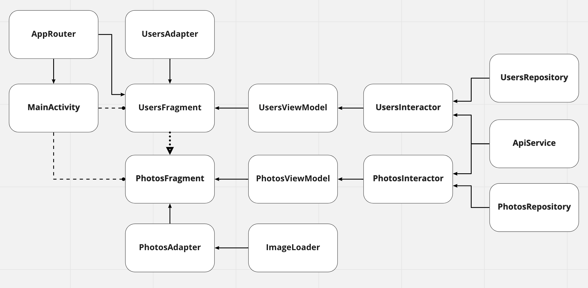

#Photo Gallery
###Тестовое задание для Gora.Studio:
Написать приложение, которое отображает фотографии каждого выбранного пользователя
**без использования библиотек** для https://jsonplaceholder.typicode.com
 Для экрана фотографий организовать кеширование картинок в памяти, отображать индикатор загрузки для каждой фотографии. Каждая ячейка имеет тень и скругленные углы. Отображать title фотографии под изображением (количество строк неограниченно).
##Предложенная архитектура

##Экраны

